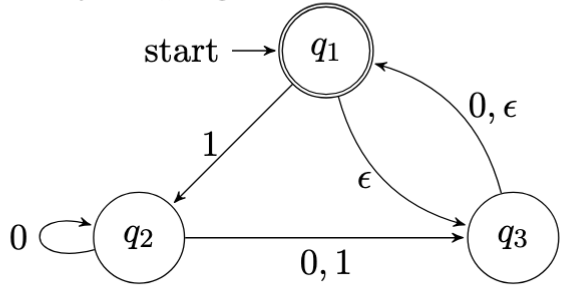

# Programming Assignment 2

Here are the resources for our team's response to programming assignment 2 for COSC-417, in which we are tasked with simulating an NFA.

The goal of the project is to write a Java program that simulates an NFA M on an input string w, and outputs ACCEPT if M accepts w, and REJECT if M does not accept w.

## Assumptions

The alphabet $Σ = \{0, 1\}$.
The NFA has $n$ states. $1 <= n <= 20$.
The starting state is $1$.

## Requirements

During execution, a NFA should be loaded from a file and simulated in the program.

The program should then prompt a user to enter an input string $w$.

The input $w$ should be parsed and then passed to the NFA to process.

If the NFA accepts the input, the program should output (print) `ACCEPT`.

If the NFA rejects the input, the program should output (print) `REJECT`.

### Input Format

The NFA is defined by a plain-text file with the following structure:

- Line 1: A single number, $n$, indicating the number of states. $|Q|$ in formal terms.
- Line 2: A list of space-separated numbers indicating accepting states. Formally, this is $F$.
  - Example: `3 11 17` means the set of accepting states $F = \{3, 11, 17\}$
- Remaining Lines: One transition per line, as a 3-tuple: (old state, symbol, new state). The special value $-1$ is used to represent an ε-transition.
  - Example: `1 0 11` — from state 1 on input symbol 0, move to state 11
  - Example: `1 -1 3` — from state 1 without needing an input, optionally move to state 3

Full input example:
```
11
3 11 17
1 0 11
1 1 7
2 0 4
2 1 6
```

## Test NFAs

The program should be tested at least with the NFA having the following states



This is described in the following file, based on the required input format described above.

```
3
1
1 1 2
2 0 2
2 0 3
2 1 3
3 0 1
3 -1 1
1 -1 3
```

## Folder Structure

The folder structure is simpler here than in many Java projects. There are a few folders to note.

- `src`: source code and tests, `.java` files
- `lib`: gitignored, external `.jar` files are here for JUnit.
- `bin`: gitignored, compiled output in class files
- `testdata`: input files to seed NFAs for unit tests


## Running Tests and Simulation

### NFA Simulation

Running the simulator is straightforward.

Ensure that you're in the folder for the assignment: `cd programming-task-2`

Then run these commands to compile and run the simulator. Note that input file is provided as well.

```shell
javac NFASimulator.java
java NFASimulator nfa.txt
```

### Tests

Ensure that you're in the folder for the assignment: `cd programming-task-2`

Following this, make the `lib` folder. This will be where we place the JUnit `.jar`.

```shell
mkdir -p lib
```

Fetch the `.jar` file.

```shell
curl -L -o lib/junit-platform-console-standalone-1.10.2.jar \
  https://repo1.maven.org/maven2/org/junit/platform/junit-platform-console-standalone/1.10.2/junit-platform-console-standalone-1.10.2.jar
```

Now we can compile the source code along with the `.jar` as a dependency. This will allow us to run our tests on the source code. We are using a wildcard for the `src/` directory to include all our `.java` files in the compilation.

```shell
javac -cp lib/junit-platform-console-standalone-1.10.2.jar -d bin src/*.java
```

Now, run the JUnit `.jar` as an executable. Note: the flags at the end of the following are flags to JUnit's `execute` command, not to `java`.

```shell
java -jar lib/junit-platform-console-standalone-1.10.2.jar execute -cp bin --scan-classpath
```

---

## Running with Docker

If you prefer to use Docker to isolate the environment, you can run the tests and the program itself as follows.

### Running Tests

First cd into the directory where the Dockerfile is: `cd programming-task-2`

Then build the image with the tag `nfa-test` that will allow us to specify it by name. Following that, run the tests by calling `docker run` on the image we built. For details about what is called, please see the Dockerfile.

```shell
docker build -t nfa-test .
docker run nfa-test
```

### Running NFA Simulator

Similarly, cd into the directory where the Dockerfile is: `cd programming-task-2`

If the image hasn't been built, build the image as above.

```shell
docker build -t nfa-test .
```

Finally, run the program itself using the `docker run -it`, which runs the command in an interactive terminal in the container.

```shell
docker run -it nfa-test java -cp bin NFASimulator testdata/nfa.txt
```
